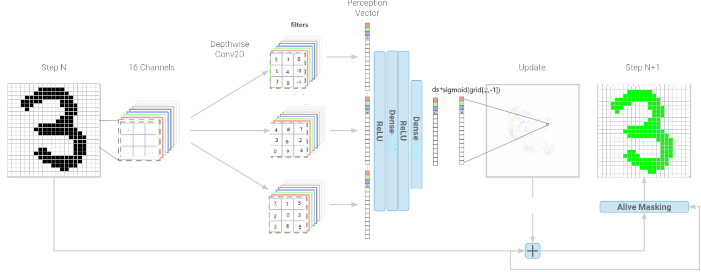
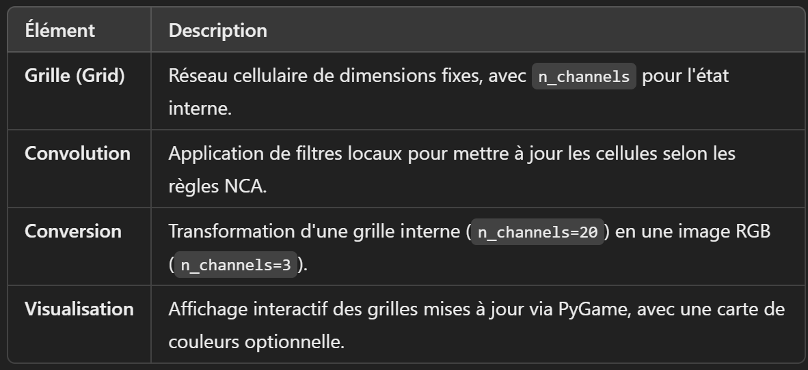

# MNIST_NCA
## Auteurs:
Mahdi Ayadi  
Aymen Awainia  
Youssef Blaiech  
Myriam Akrout  
Rayen Soufargi  
Chaima Baccara

## Description

Ce projet explore une approche originale pour résoudre le problème de classification des chiffres manuscrits du dataset MNIST en utilisant des automates cellulaires neuronaux (NCA). Contrairement à l'approche classique basée sur les réseaux de neurones convolutifs (CNN), cette méthode repose sur une grille d'automates cellulaires, où chaque cellule suit des règles locales apprises par un modèle pour générer un comportement global efficace.

 
#    Sprint 0:

F1: installation des modules nécessaitres en local: Pytorch, Matplotlib, tkinter 

F2: création du repo git et version control

F3: conception globale

#   Sprint 1: Network Training

F4: récupération & encodage du Dataset

F5: Définition du modèle NCA (POO)

F6: initialisation et entrainement de NCA

F7: validation du modèle

F8: sauvegarde des poids du modèle

#    Sprint 2: Visualisation et intégration du modèle 

F9: implémentation avec matplotlib.animation

F10: création de la fonction main (input ==> identification par code de couleurs)

#    Sprint 3: développement de l'UI:

F11: Préparation de l'interface TKINTER

F12: Visualisation des grilles en évolution sur TKINTER

F13: création de l'outil du dessin autonome

F14: Amélioration de la solution en utilisant Pygame au lieu de Tkinter 

#  Sprint 4: Améliorations du projet

F15: Ajout des courbes d'évolution de la précision (précision générale, précision sur chaque chiffre) et des courbes de loss lors du training

# Modèle

#  Conception

Class NCA:

Cette classe implémente le cœur de l'automate cellulaire neuronal. Elle contient les paramètres et les méthodes nécessaires pour définir, initialiser et mettre à jour l'état du réseau de cellules.

Attributs:

width et height : Dimensions de la grille. ==>
Définissent la largeur et la hauteur du réseau cellulaire.

n_channels : Nombre de canaux internes. ==>
Représente les états internes des cellules (par exemple, 20 canaux).

n_filters : Nombre de filtres convolutifs. ==>
Spécifie les dimensions et la profondeur des filtres (par ex. [3, 3, 20]).

Tmin, Tmax : Paramètres temporels.==>
Fixent les bornes pour les itérations d'évolution de la grille.
Method= NCA(width, height, n_channels, n_filters, n_dense, Tmin, Tmax)

Méthodes :

forward(grid0) :
Effectue une étape d'évolution sur l'état initial grid0, renvoyant une nouvelle grille transformée.

update(gridn) :
Applique les règles locales d'automate pour calculer l'état suivant de la grille (gridn+1).

convertir(grid) :
Transforme une grille interne avec n_channels=20 en une grille RGB (n_channels=3) pour l'affichage.

Class Affichage _NCA :

Cette classe est responsable de la gestion et de l'affichage des états de grille produits par le modèle NCA, en utilisant une carte de couleurs ou d'autres transformations visuelles.

Attributs :

input_grid :
Grille d'entrée ou sortie du modèle NCA à visualiser.

color_map :
Carte de couleurs définissant comment les états des cellules sont mappés aux couleurs (par exemple, une palette RGB).

Méthodes :

__init__(input_grid, color_map) :
Initialise la classe avec la grille et la carte de couleurs.

next_img() :
Génère l'image suivante basée sur l'état actuel de la grille, prête pour l'affichage en RGB.

# Modules à avoir pour faire tourner le code 

Il faudra avoir les modules : - numpy
                              - matplotlib (matplotlib.pyplot, matplotlib.animation)
                              - pytorch (torch, torch.nn, torchvision, torch.utils.data, )
                              - pygame
                              - sys
                              - math
                              - random
                              - os
                              - PIL (Image, ImageDraw)
                              - tqdm
                              

# Comment avoir la démo ?

Il faut :  - faire tourner le code du fichier main.py

           - dessiner un chiffre

           - Voir si le résultat (animation) correspond à la palette suivante : 
           
                - 0 : rouge
                - 1 : vert
                - 2 : noir
                - 3 : orange
                - 4 : rose
                - 5 : bleu 
                - 6 : jaune 
                - 7 : gris
                - 8 : violet
                - 9 : marron

           - Pour refaire un nouveau test :
           appuyer sur 'c' pour effacer (optionnel) et redissiner de nouveau
# MVP
             fichier src/animation/animation_pygame.py :
            Grâce au module pygame, on a pu créer une 
            interface sur laquelle on dessine un chiffre qui sera 
            reconnu selon le code couleur énoncé plutôt.

# The models

Model 1: 
    Loss: MSE
    n_channels = 20
    n_filters = 64
    Tmin = 50
    Tmax = 100

Model 2: 
    Loss: MSE
    n_channels = 25
    n_filters = 80
    Tmin = 50
    Tmax = 150

Model 3: 
This model is similar to Model 1 but we added a multiplication by the sigmoid applied to the last channel of the cell 
(To train the model to push the values of delta to approach 0)
    Loss: MSE
    n_channels = 20
    n_filters = 64
    Tmin = 50
    Tmax = 100

Model 4: 
In this model too we add a multiplication by the sigmoid applied to the last channel of the cell 
    Loss: CrossEntropy
    n_channels = 20
    n_filters = 64
    Tmin = 50
    Tmax = 100

## Installation
Instructions pour installer le projet :

git clone https://gitlab-cw2.centralesupelec.fr/aymen.awainia/mnist_nca.git

